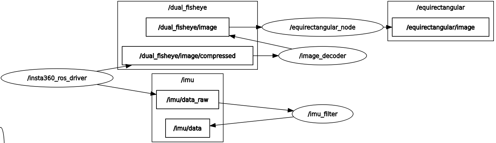

# insta360_ros_driver

A ROS driver for the Insta360 cameras. This driver is tested on Ubuntu 24.04 with ROS2 Jazzy. The driver has also been verified on the Insta360 X3 cameras.

For X4 cameras, see this [fix](https://github.com/ai4ce/insta360_ros_driver/issues/13#issuecomment-2727005037)

## Installation
To use this driver, you need to first have Insta360 SDK. Please apply for the SDK from the [Insta360 website](https://www.insta360.com/sdk/home). 

```
cd ~/ros2_ws/src
git clone -b jazzy https://github.com/nobuchi/insta360_ros_driver
cd ..
```
Then, the Insta360 libraries need to be installed as follows:
- add the <code>camera</code> and <code>stream</code> header files inside the <code>include</code> directory
- add the <code>libCameraSDK.so</code> library under the <code>lib</code> directory.

Afterwards, install the other required dependencies and build
```
rosdep install --from-paths src --ignore-src -r -y
colcon build --symlink-install
source install/setup.bash
```

Before continuing, **make sure the camera is set to dual-lens mode**

The Insta360 requires sudo privilege to be accessed via USB. To compensate for this, a udev configuration can be automatically created that will only request for sudo once. The camera can thus be setup initially via:
```
cd ~/ros2_ws/src/insta360_ros_driver
./setup.sh
```
This creates a symlink  based on the vendor ID of Insta360 cameras. The symlink, in this case <code>/dev/insta</code> is used to grant permissions to the usb port used by the camera.


**Sometimes, this does not work (e.g. you see "device /dev/insta not found" or something similar). You can try entering the commands manually, since that sometimes sees success, especially for the first time.**
```
echo SUBSYSTEM=='"usb"', ATTR{idVendor}=='"2e1a"', SYMLINK+='"insta"' | sudo tee /etc/udev/rules.d/99-insta.rules
sudo udevadm trigger
sudo chmod 777 /dev/insta
```
**Note that you need to setup permissions every time the camera is turned off or disconnected.**

## Usage
This driver directly publishes the video feed in YUV format, since that is the camera's native setting. Alongside this, the driver also publishes the camera feed as standard BGR images to the <code>/front_camera_image/compressed</code> and <code>/back_camera_image/compressed</code> topics. Note that the compressed images have some amount of latency (~50 ms) compared to the raw output. 

### Camera Bringup
The camera can be brought up with the following launch file
```
ros2 launch insta360_ros_driver bringup.launch.py
```


A dual fisheye image will be published.


#### Published Topics
- /dual_fisheye/image
- /equirectangular/image
- /imu/data
- /imu/data_raw

The launch file has the following optional arguments:
- equirectangular (default="true")


Whether to enable equirectangular image projection

- undistort (default="false")

Whether to publish front and back rectilinear images


The IMU allows for frame stabilization. For instance, you are able to visualize the orientation of the camera.


## Star History

[](https://star-history.com/#ai4ce/insta360_ros_driver&Date)

## Publish YUV

```
ros2 launch insta360_ros_driver bringup_yuv.launch.py 
```


#### Published Topics
- /dual_fisheye/yuv_image
- /imu/data_raw